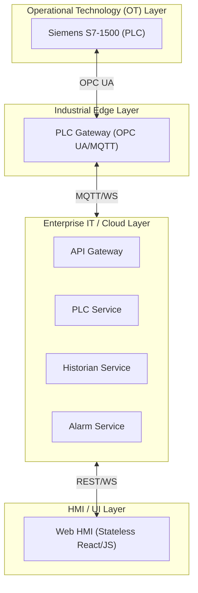

# Elevador Enterprise Automation

An industry-grade blueprint for modern Industrial Automation (CES 2026), demonstrating OT/IT convergence, Cloud-Native architecture, and Enterprise governance.

## Executive Summary

This project serves as a professional reference for scaling industrial control systems. It transitions from a traditional monolithic PLC approach to a distributed, event-driven architecture that is observable, secure, and scalable.

### Key Pillars
- **Zero Trust Security**: IAM-based access control and encrypted communication between OT and IT layers.
- **Microservices Orchestration**: Fully containerized services using Docker/Kubernetes.
- **Event-Driven Architecture**: Asynchronous communication enabling real-time status updates and historiography.
- **Edge Computing**: Gateway layer designed for protocol translation (OPC UA to MQTT/WebSockets).

## System Architecture

## Technology Stack

| Layer | Technologies |
| :--- | :--- |
| **OT** | TIA Portal, SCL, S7-PLCSIM Advanced |
| **Logic/Services** | Python 3.11+, FastAPI, Docker |
| **Storage** | Prometheus (Time-series), Historian (Custom JSON/SQL) |
| **Frontend** | Vanilla JS/React (Stateless/Real-time) |
| **Infra** | Docker Compose, Kubernetes (Ready) |

## Use Cases
1. **Predictive Maintenance**: Data extraction for ML-based fault detection.
2. **Multi-Plant Monitoring**: Scalable historian service for fleet management.
3. **Advanced Security Auditing**: Centralized logging for industrial compliance.

## Technical Roadmap
- [ ] Phase 1: Real-time synchronization and HMI parity.
- [ ] Phase 2: Integration of AI-driven anomaly detection.
- [ ] Phase 3: Global deployment via Kubernetes (K8s) clusters.

---
> [!IMPORTANT]
> This repository is a professional blueprint. All architectural decisions prioritize reliability and security over academic simplicity.
